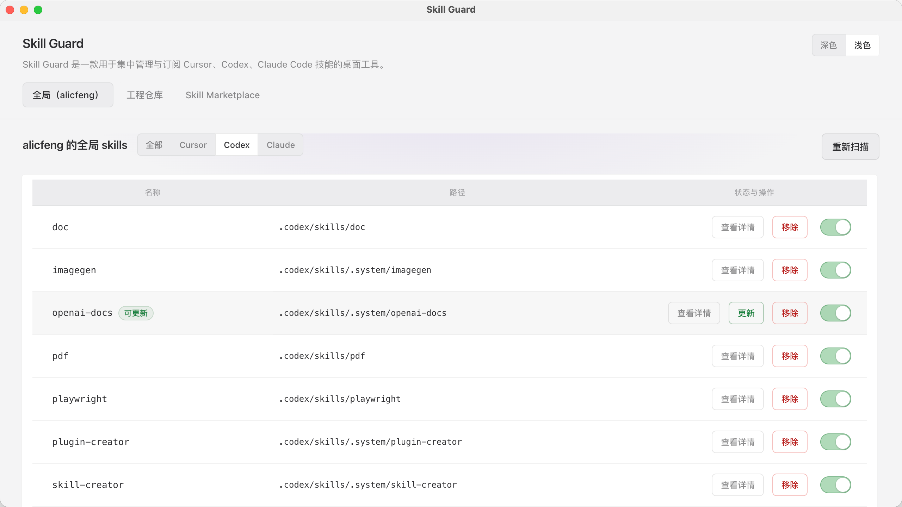
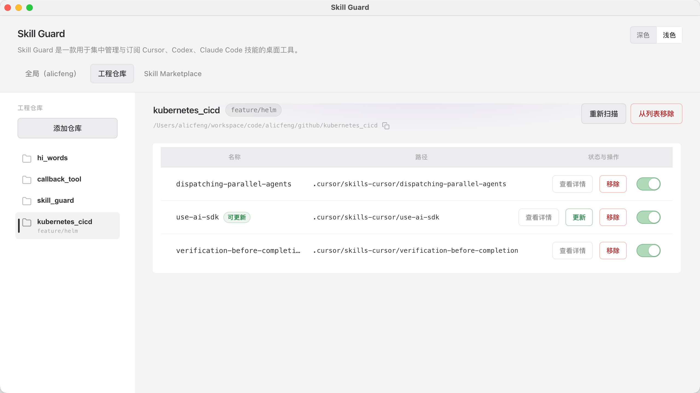
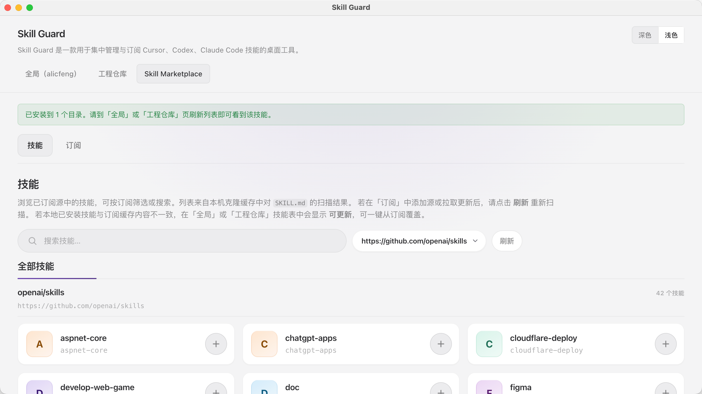

<h1 align="center">
  <a href="https://github.com/alicfeng/ai_skill_guard">
  Skill Guard
  </a>
</h1>

  Skill Guard 一款基于 electron 构建并支持管理和订阅 ai skills 的桌面管理工具🛠

  
  
  

## 🚀 功能概览

- [x] 可以检索用户层级所有 `skills`，同时支持 `cursor`、`codex`、`claude code`

- [x] 支持 `skills marketplace` 安装技能，技能市场支持以订阅方案知晓更新 `skill`

- [x] 覆盖技能发现、地址订阅、安装、更新提醒、启用/禁用周期流程闭环，以及主流 `skill` 订阅源推送

## 🪤 快速安装

打开 [**Releases**](https://github.com/alicfeng/skill_guard/releases) 即可下载，支持 `Linux/Mac/Windows`。选择对应系统自行下载安装，也可下载源码编译运行。

## 🏷  工具截图

- 用户全局技能列表

  

- 工程仓库技能列表

  

- 技能市场

  技能源对应技能查阅

  

  技能订阅

  

## License

MIT. Free forever. 
